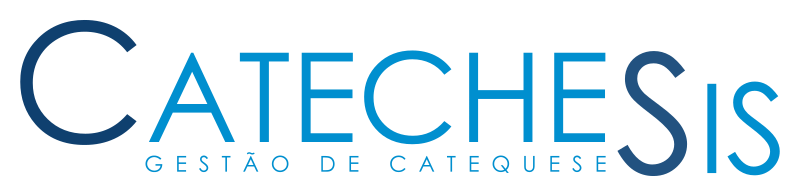

_**[PT] Software open-source para gestão de catequese, concebido por catequistas, para catequistas.**_

_**[EN] Open-source catechesis management software made by catechists for catechists.**_

-------
*See [English version](#english) below.*

# O que é o CatecheSis?

O CatecheSis é um sistema livre, *open-source*, concebido por catequistas e para catequistas para atender às necessidades da sua paróquia.

Faça a gestão da catequese paroquial online, de forma prática e simples, através de uma aplicação web.

Inclui recursos como:

- Inscrições / renovações de matrículas online;
- Gestão de grupos de catequese e catequistas;
- Arquivo do percurso catequético de catequizandos;
- Registo de sacramentos;
- Ferramenta de apoio à decisão para sacramentos;
- Análises estatísticas;
- Catequese virtual, com publicações e video-chamadas;

**Veja todos os recursos em [https://catechesis.org.pt](https://catechesis.org.pt).**

# Como começar a utilizar na sua paróquia?

Para começar a utilizar o CatecheSis na sua paróquia, só precisa de um servidor web e um domínio na Internet.

Descarregue o software compilado e pronto a utilizar a partir de [https://catechesis.org.pt](https://catechesis.org.pt//transferir.php) e instale-o no servidor da sua paróquia.

O CatecheSis inclui um assistente de instalação passo-a-passo e um [manual de instalação](https://catechesis.org.pt/help/manual_de_instalacao.html) que o orientará no processo de instalação no servidor.

Acreditamos que o CatecheSis é suficientemente simples e intuitivo, e esforçamo-nos para o melhorar dia após dia, para que encontre facilmente tudo aquilo de que precisa. 
Em todo o caso, o [manual do utilizador](https://catechesis.org.pt/help/manual_do_utilizador.html) pode ajudá-lo a completar as principais tarefas.

Se ainda tiver dúvidas, a nossa comunidade de desenvolvedores e utilizadores no Discord poderá dar-lhe apoio.

# Como contribuir?

Ficamos felizes por acreditar neste projeto tanto quanto nós, e por manifestar interesse em colaborar connosco! :)

Há várias formas de contribuir para o CatecheSis, como por exemplo:

- Divulgando o CatecheSis na sua paróquia ou em paróquias vizinhas;
- Ajudando a formar outros utilizadores, quer presencialmente, quer esclarecendo dúvidas na nossa comunidade online;
- Identificando e reportando erros;
- Fazendo sugestões;
- Implementando código para novas funcionalidades ou correções;

Para começar a contribuir, contacte-nos através do nosso [formulário de contacto](https://catechesis.org.pt/contactos.php) em catechesis.org.pt e junte-se a nós na nossa comunidade no Discord.

Veja também o documento [CONTRIBUTING.md](CONTRIBUTING.md) *(em língua inglesa)*.

# Para desenvolvedores

Se desejar contribuir desenvolvendo código para o CatecheSis, comece por clonar este repositório.

O ambiente de desenvolvimento assenta em *containers* Docker, facilitando a instalação de todas as dependências para que possa começar a programar rapidamente.

Dispomos de documentação interna no código (PHP Doc), bem como documentação externa na diretoria `doc` que o ajudará a montar o ambiente de desenvolvimento e compilar o CatecheSis.

A documentação interna para desenvolvedores está a ser criada e deve ser mantida em língua Inglesa.

Antes de contribuir, por favor consulte as instruções em [CONTRIBUTING.md](CONTRIBUTING.md)

-------

# What is CatecheSis?

CatecheSis is a free, *open-source* software designed by catechists and for catechists to meet the needs of your parish.

Manage parish catechesis online, in a practical and simple way, through a web application.

Includes features like:

- Online enrollment / enrollment renewals;
- Management of catechesis groups and catechists;
- Archive of the catechetical path of the catechumens;
- Registration of sacraments;
- Decision support tool for sacraments;
- Statistical analysis;
- Virtual catechesis, with publications and video calls;

**See all resources at [https://catechesis.org.pt](https://catechesis.org.pt).**

 

**NOTE: CatecheSis is currently available only in Portuguese language.**

If you find this project useful and would be willing to help translating it to your mother language, contact us! We would appreciate your contribution! :)

Although the user interface is written in Portuguese, we are making efforts to guarantee that the source code and internal documentation are written in English, to facilitate the colaboration of developers from other countries.

See also [CONTRIBUTING.md](CONTRIBUTING.md).

-------
Made with ❤️ by catechists and You!